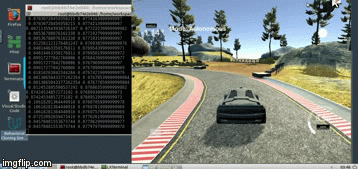

# Behavioral Cloning Project

In this project an end-to-end deep neural network is used to clone driving behavior. Image data from three front cameras is used as features and the vehicles steering angles as labels to train the regression neural network.  To collect the data, [Udacity's simulator](https://github.com/udacity/self-driving-car-sim) is used to steer a car around a track. This repo uses [Udacity's CarND-Behavioral-Cloning repo](https://github.com/udacity/CarND-Behavioral-Cloning-P3/blob/master/writeup_template.md) as a base template and guide.

<p align="center"> 
  
</p>

[//]: # (List of Images used in this README.md)
[image1]: ./README_images/test_track2.gif "Track 2 Test"
[image2]: ./README_images/simulator.JPG "Simulator"
[image3]: ./README_images/sim_control.JPG "Simulator Control"
[image4]: ./README_images/frontview.gif "Video Ouput"
[image5]: ./README_images/sample_of_log.JPG "Log Sample"
[image6]: ./README_images/distribution.png "Distribution"
[image7]: ./README_images/flipped.png "Flipped Sample"
[image8]: ./README_images/shadow.png "shadow Sample"
[image9]: ./README_images/architecture.png "Model Architecture"

## Directory Structure and Project's Workflow
```
├── CarND-Behavioral-Cloning-P3
│   ├── drive.py                 # test script: driving the car in autonomous mode (makes use of model.h5)
│   ├── model.h5                 # trained Keras model ready for testing or keep training   
│   ├── model.py                 # contains the script to create and train the model (generates model.h5)
│   ├── README_images            # Images used by README.md
|   │   └── ...
│   ├── README.md
|   ├── .gitignore               # git file to prevent unnecessary files from being uploaded
|   ├── requirements.txt         # necessary libraries to pip install
│   ├── video.py                 # A script that makes a video from images.
│   └── output_run.mp4           # Output video generated by `video.py` 
└── MYDATA                       # Data used for training and validation (not included in the repo)
    ├── custom.csv
    ├── driving_log.csv
    ├── IMG
    └── max.csv
```

The workflow of this project is the following:
* Use the simulator in "training mode" to collect data of good driving behavior and place it in `MYDATA`
* `model.py` uses the data in `MYDATA` to train and validate the model and saves it as `model.h5`
* `drive.py` interacts with the simulator in "autonomous mode" to receive image data
* `drive.py` uses `model.h5` to predict a steering angle from that image data and sends the angle back to the simulator.
Therefore the simulator acts as a client and `drive.py` as the server.

## Installation 
Since this is a python project that requires compatibility among the libraries it is recommended to use a python environment for the set up. Open your terminal and type:
```sh
git clone https://github.com/laygond/Behavioral-Cloning.git
cd Behavioral-Cloning
mkvirtualenv BehavioralEnv -p python3   # Recommended
pip install -r requirements.txt         # Or install manually
```
type `deactivate` in terminal to exit environment.

## Udacity's Simulator
The simulator can be downloaded [here (Choose Term 1 Version)](https://github.com/udacity/self-driving-car-sim) and a docker file can be found [here](https://github.com/udacity/CarND-Term1-Starter-Kit). The simulator allows you to chose training mode for collecting data or autonomous mode for testing your model. In either mode there are two tracks you can drive on. For this project we will only focus our training on track 1. The control display is also shown below.

Main Menu | Controls
:---:|:---:
![alt text][image2] |  ![alt text][image3]

Additional Installation Instructions for Unix based OS. Once the simulator's directory is downloaded and extracted, set file to executable for it to work
```
chmod +x beta_simulator.x86_64
```

Additional Control Information:
- You can takeover in autonomous mode while W or S are held down so you can control the car the same way you would in training mode. This can be helpful for debugging. As soon as W or S are let go autonomous takes over again.
- Pressing the spacebar in training mode toggles on and off cruise control (effectively presses W for you).

## Run Project (Self Driving Car Simulation)
After you have installed the simulator set it in `autonomous mode`. Then got to your Behavioral-Cloning repo in your terminal and type:

```sh
python drive.py model.h5
```
The above command will load the trained model and use the model to make steering angle predictions on individual images in real-time

#### Saving a video of your autonomous simulation
By running the following commands it will save your simulation as single frame images in directory `output_run` (if the directory already exists, it'll be overwritten). Then based on images found in the `output_run` directory the script `video.py` will create a video with the name of the directory followed by `'.mp4'`, so, in this case the video will be `output_run.mp4`. Finally, and optionally, remove the directory `output_run` which is no longer needed.

```sh
python drive.py model.h5 output_run
python video.py output_run
rm -rf output_run
```
Alternatively, one can specify the FPS (frames per second) of the video. The default FPS is 60 if not specified:
```sh
python video.py output_run --fps 48
```

Video Output Sample: `output_run.mp4`

![alt text][image4]

## Project Analysis
### Dataset
The dataset is collected from the simulator. In training mode you can stop and play the recording as many times as you want and all collected data will be appended to the folder you have specified. But if you close and reopen the session by setting the same folder path from before then it will be overwritten.

If everything went correctly for recording data, you should see the following in the directory you selected. In my case I placed it in `MYDATA` at the same level directory as this repo as shown in `Directory Structure`
- IMG folder - this folder contains all the frames of your driving during training mode.
- driving_log.csv - each row in this sheet correlates your image with the steering angle, throttle, brake, and speed of your car.

![alt text][image5]

For this project we will use the center, left, and right camera images and the steering angles. 
- Steering is between [-1,1]
- Trottle between [0,1]
- Break or Reverse Throttle [0,1] 
- Speeed in mph

### Strategies for Collecting and Cleaning the Data
Collecting data correctly will ensure a successful model. Collect data of car:
- staying in the center of the road as much as possible
- veering off to the side and recovering back to center
- driving counter-clockwise can help the model generalize

To clean the data collected I have created an easy tool that can be run from terminal.
```
python clean_data.py --input driving_log.csv --output custom.csv
```
Distribution of Steering Angle: Original vs. Clean Custom Data

![alt text][image6]

This cleaning tool will:
- Remove last 5 seconds of data (I always ended up crashing the car at the end of the simulation)
```
fps = 30        #data points per second
df = df.head(-fps*5)
```
- Keep only data with forward speed higher than 5mph to purge starting of engine ( I used to steer left & right before starting)
```
df = df.loc[(df["throttle"] > 0) & (df["speed"] > 5)]
```
- Even out distribution of steering angle data to prevent model from being bias; i.e., create a histogram of steering angles of about 1000 bins and clip bin at a max of 200 steering angle values.
```
custom = pd.DataFrame() 	# custom balanced dataset
bins   = 1000				      # Number of bins
clip   = 200              # Max number of steering angle data points per bin 
start  = 0                # starting bin width range
for end in np.linspace(0, 1, num=bins):
    # Filter, Clip, and Add  
    df_bin = df.loc[(np.absolute(df["steering"]) >= start) & (np.absolute(df["steering"]) < end)]
    df_bin = df_bin.head( min(clip, df_bin.shape[0]) )
    custom = pd.concat([custom, df_bin])
    start = end
```

After the data has been purged, 80% will be used for training and 20% for validation. By running `python model.py` the data will be preprocessed & augmented, and the model trained.

### Data Augmentation and Preprocessing
The following tricks will be implemented to augment training data by a factor of 12.
- Augmenting data by using the left and right cameras as if they were in the center by applying correction to angle. This augments data by a factor of 3. In the following, one line of the `custom.csv` file is a `batch_sample`.
```
angle_correction = [0. , .25, -.25] # center, left, right
for camera_position in range(3):    # center, left, right
  # Load feature and label
  img_path = '../MYDATA/IMG/'+batch_sample[camera_position].split('/')[-1]
  image = cv2.imread(img_path)
  angle = float(batch_sample[3]) + angle_correction[camera_position]
```
- Flipping the images horizontally (and steering angles) is a quick way to augment the data by a factor of 2.
```
cv2.flip(img,1)
```
![alt text][image7]
- Adding shadow to images is a way to augment the data and generalize the model.
```
def shadow(img):
  """
  Add random shadow to your image by using y=mx+b principal.
  Add a slope line inside the image, then dim one side of
  the image while keeping the other side intact. 
  """
  img = np.copy(img)
  h, w = img.shape[0:2]
  [x1, x2] = np.random.choice(w, 2, replace=False)
  m = h / (x2 - x1)
  b = - m * x1    # find intercept 0=mx+b
  for i in range(h):
      x = int((i - b) / m)    # from i=mx+b
      img[i, :x, :] = (img[i, :x, :] * .5).astype(np.uint8)

  return img
```
![alt text][image8]
- Cropping the region of interest and normalization is done directly by the model as seen in the model architecture code in the next section. When done by the model, these preprocessing functions are executed in batches rather than a single batch_sample.  

### Model Architecture
The model architecture written in Keras is taken from [Nvidia's paper](https://arxiv.org/pdf/1604.07316v1.pdf). As regularization techniques, data augmentation has been implemented. The neural network is quite simple. It uses a series of convolution layers followed by relu activations with appropriate filter sizes. Then it is flatten to go through a sries of fully connected layers. The input data is normalized and cropped at the beginning of the model.

![alt text][image9]

```
# Model Net
model = Sequential()
ch, row, col = 3, 160, 320
model.add(Cropping2D(cropping=((50, 20), (0,0)), input_shape =(row,col,ch)))
model.add(Lambda(lambda x: x/127.5 - 1.)) # Normalized centered around zero with small standard deviation
model.add(Convolution2D (24,5,5,subsample=(2,2),activation="relu"))
model.add(Convolution2D (36,5,5,subsample=(2,2),activation= "relu"))
model.add(Convolution2D (48,5,5,subsample=(2,2), activation="relu"))
model.add(Convolution2D (64,3,3,activation="relu"))
model.add(Convolution2D (64,3,3, activation="relu"))
model.add(Flatten())
model.add(Dense(100))
model.add(Dense(50))
model.add(Dense(10))
model.add(Dense(1))
model.compile(loss='mse', optimizer= Adam(lr = 1e-4))
```
The model was trained using Adam optimiser with a learning rate = 1e-04 and mean squared error as a loss function. 20% of the collected data was used for validation.

### Results
To test the car we will use Track 2 previously unseen.

![alt text][image1]

The car stays in the center of the lane for the entire track showing the efficiency of the model and the techniques implemented. 